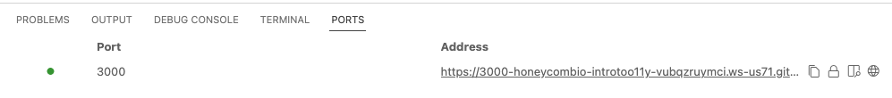

# Intro to Observability: OpenTelemetry in Go

This application is here for you to try out tracing.
It consists of a microservice that calls itself, so you can simulate
a whole microservice ecosystem with just one service!

## What to do

Recommended:

[](https://gitpod.io/#https://github.com/honeycombio/intro-to-o11y-go)

Gitpod is a free cloud environment where you can run the example without needing to clone the code or install Go on your machine.

You can also clone this repo and run the app locally. 
If you use VSCode Devcontainers, this repository is set up for that. 
Otherwise, the app will require golang (version 1.17+) to be [installed](https://go.dev/doc/install).

### Start the App

`./run`

### See the App

If you are running the app in Gitpod, navigate to the "Ports" tab and click the address for port 3000 to open the app in a new tab:



If you are running locally, access the app at [http://localhost:3000](http://localhost:3000)

Activate the sequence of numbers by selecting the **Go** button.

After the app displays numbers, select **Stop**.

Try this a few times.

### Stop the App

Push `Ctrl-C` in the terminal where the app is running.

### Configure Tracing to Honeycomb

Next, configure the app to send traces to Honeycomb using an environment variable.

[Log in to honeycomb](ui.honeycomb.io) and [get a Honeycomb API Key](https://docs.honeycomb.io/getting-data-in/api-keys/#find-api-keys).

Next, the repo comes with an example env file you can copy to get started:

`cp .env.example .env`

Edit `.env` and replace the placeholder value for HONEYCOMB_API_KEY with your own Honeycomb API key. 
This file will be ignored by git, so you will not accidentally commit your API key.

```bash
export HONEYCOMB_API_KEY=<your-Honeycomb-api-key-goes-here>
```

### See the Results

Run the app. Activate the sequence of numbers.

Go to [Honeycomb](https://ui.honeycomb.io) and choose the `fib-microsvc` service.

How many traces are there?

How many spans are in the traces?

Why are there so many??

Which trace has the most, and why is it different?

## 2. Customize a Span

Let's make it easier to see what the "index" query parameter is.

In the `fibHandler` function in `main.go`, after parsing the index from the query, add it as a custom attribute (search for "CUSTOM ATTRIBUTE" in main.go):

`trace.SpanFromContext(ctx).SetAttributes(attribute.Int("parameter.index", i))`

Restart the app, make the sequence go, and find that field on the new spans.

Can you make the trace waterfall view show the index? What pattern does it show?

## 3. Create a Custom Span

Make the calculation into its own span, to see how much of the time spent on this service is the meat: adding the fibonacci numbers.

In `fibHandler`, surround the addition statement with a span start and end (search for "CUSTOM SPAN" to find it):

```go
	tr := otel.Tracer("calculator")
	ctx, span := tr.Start(ctx, "calculation")
  // interesting code here
	defer span.End()
```

After a restart, do your traces show this extra span?
Do you see the name of your method?
What percentage of the service time is spend in it?
